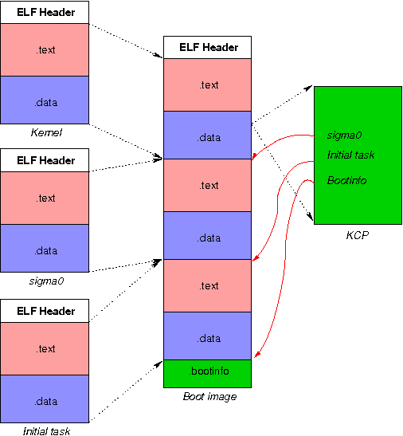

===============
 Dite overview
===============

:Author: Ben Leslie <ben.leslie@nicta.com.au>
:Copyright: National ICT Australia, 2005

.. contents::

Dite, at its most basic level, is a tool for merging multiple object
files into output file. This is extermely useful when developing
modular operating systems. Most boot loaders are only capable of
installing one ELF or binary file, however the operating systems we
are developing are compiled into a set of different executable
files. This tool provides us with a way for the boot loader to install
multipe executables at system boot time.

Example
=========

As an example the L4 operating system needs, at a minimum, a kernel,
an initial pager (known as sigma0) and and intial task. The image
shows how these three binary files are merged into a single dite
image.

Apart from merging, dite also fills out BootInfo headers, and patches
the L4 kernel configuration page.

You shouldn't need to invoke dite manually. The build system handles
the compilation and use of dite.

History and authors
====================

Dite has been around for a long time, and had a few different people
work on it in that time. Its predecessor, dit, was written by Kevin
Elphinstone for the U4600 machines. It was later ported to Alpha by
Daniel Potts. Simon Winwood did a rewrite as dite which was largely
platform independant, and added some new features. Finally it has been
hacked on by Ben Leslie and Nicholas FitzRoy-Dale to provide support
for L4::Pistachio and the Kenge build system.
